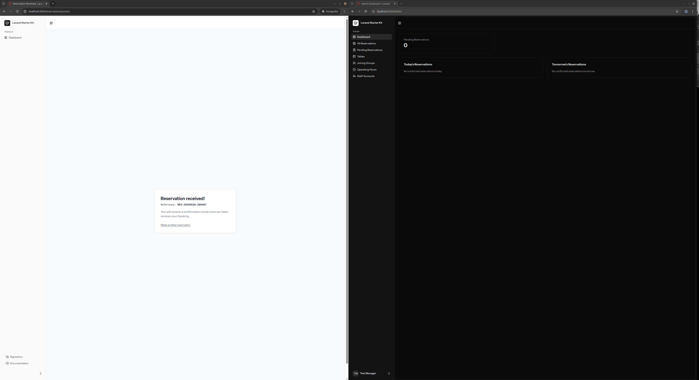
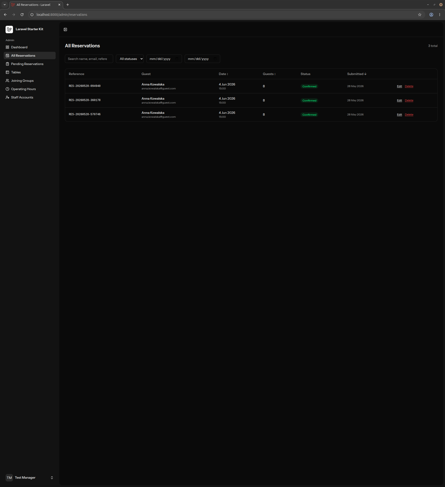

**ID:** BUG-001  
**Title:** Admin panel does not receive new reservations in real time; manual refresh required.  
**Severity:** Major.  
**Environment:** Chrome 148.0.7778.178, Docker.  
**Preconditions:** Fresh local test environment passing smoke tests ST-001, ST-002, ST-003.  
**Steps to reproduce:**

1. Open first instance of browser.
2. Go to `/login` and log in with Test Manager credentials.
3. Go to `/admin`.
4. Number of pending reservations show 0.
5. Open second instance of browser.
6. Go to `/` and check availability for B1 case ([test-data.md](../manual-tests/test-data.md)).
7. Fill the form **Your details** with credentials for G1 guest ([test-data.md](../manual-tests/test-data.md)).
8. Submit form.
9. Go to first browser instance.

**Expected result:** Information about new reservation should show in tost in real time and pending reservations counter should increase to 1.
**Actual result:** The number of pending reservations shows 0. No tost information. Pending reservation counter updates to 1 only after reloading admin panel.
**Suspected root cause:** Laravel Reverb client appears not to be initialized on `/admin`. DevTools Network → WS tab shows no WebSocket connection on the admin route, while the public `/` route does establish one (see ST-002).

**Evidence:**  

---

**ID:** BUG-002  
**Title:** The system allows the manager to confirm reservations even when the slot is fully booked.  
**Severity:** Major.  
**Environment:** Chrome 148.0.7778.178, Docker.  
**Preconditions:** Fresh local test environment passing all smoke tests.  
**Steps to reproduce:**

1. Open first instance of browser.
2. Navigate to `/`.
3. Check availability for B2 case ([test-data.md](../manual-tests/test-data.md)).
4. Fill the form **Your details** with credentials for G1 guest ([test-data.md](../manual-tests/test-data.md)).
5. Submit the form.
6. Repeat steps 2.-5. two more times.
7. Go to Mailpit UI ( default:`http://localhost:8025`).
8. In UI search for three emails addressed to <manager@example.com> with subject starting with: **New reservation request**.
9. In each email click signed link **Confirm Reservation**.
10. Open second instance of browser.
11. Go to `/login` and log in with Test Manager credentials.
12. Go to `/admin/reservations`

**Expected result:** There should be only one reservation with the status **Confirmed**. The system should inform the manager that there are multiple pending reservations for the same slot (in the email, below the signed links, and also at `admin/reservations/pending`, where reservations for the same slot should be grouped). Confirming one of them should block the acceptance of other reservations for the same slot.  
**Actual result:** There are three reservations from guest G1 with the status **Confirmed**. The manager is able to accept multiple reservations for the same time slot, even though only one table is available at that time. The system does not display any warning or information about the reservation collision.  
**Evidence:**

---
