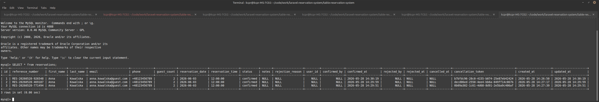
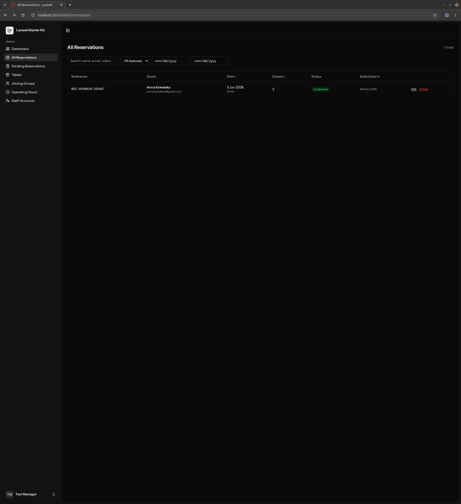
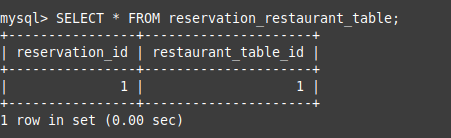
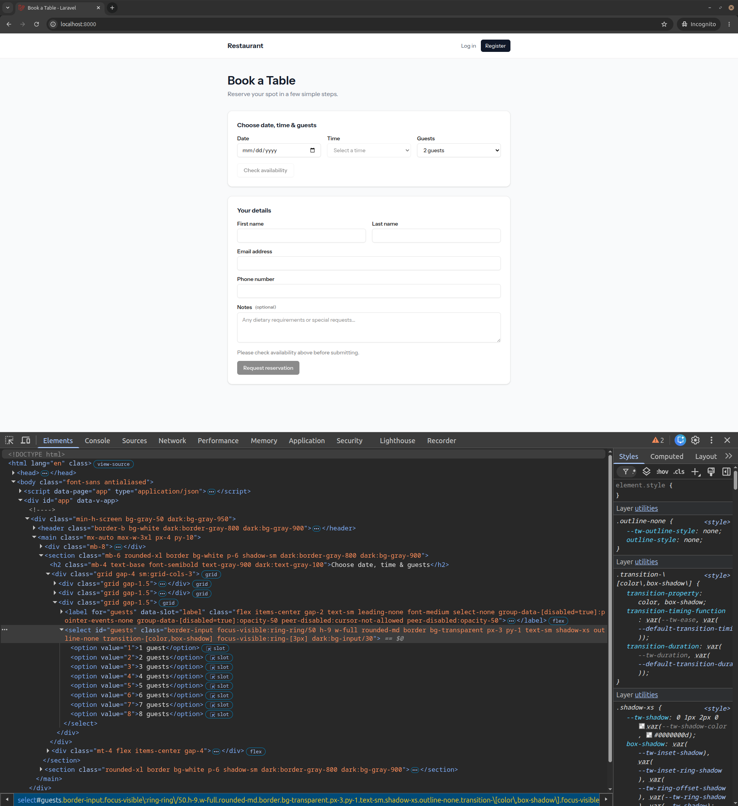
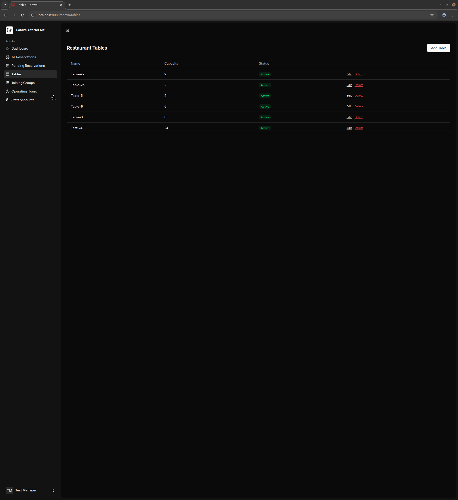
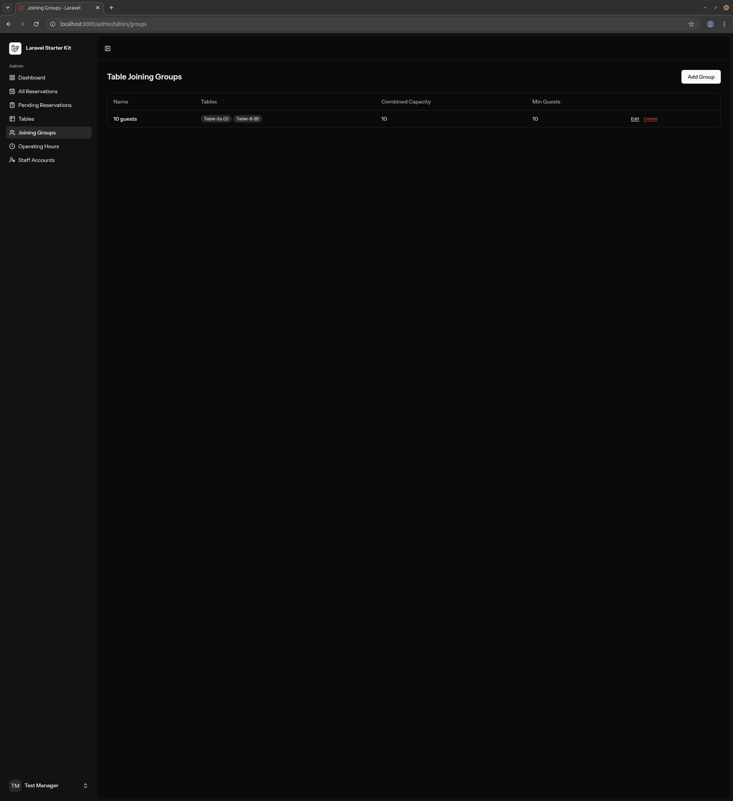
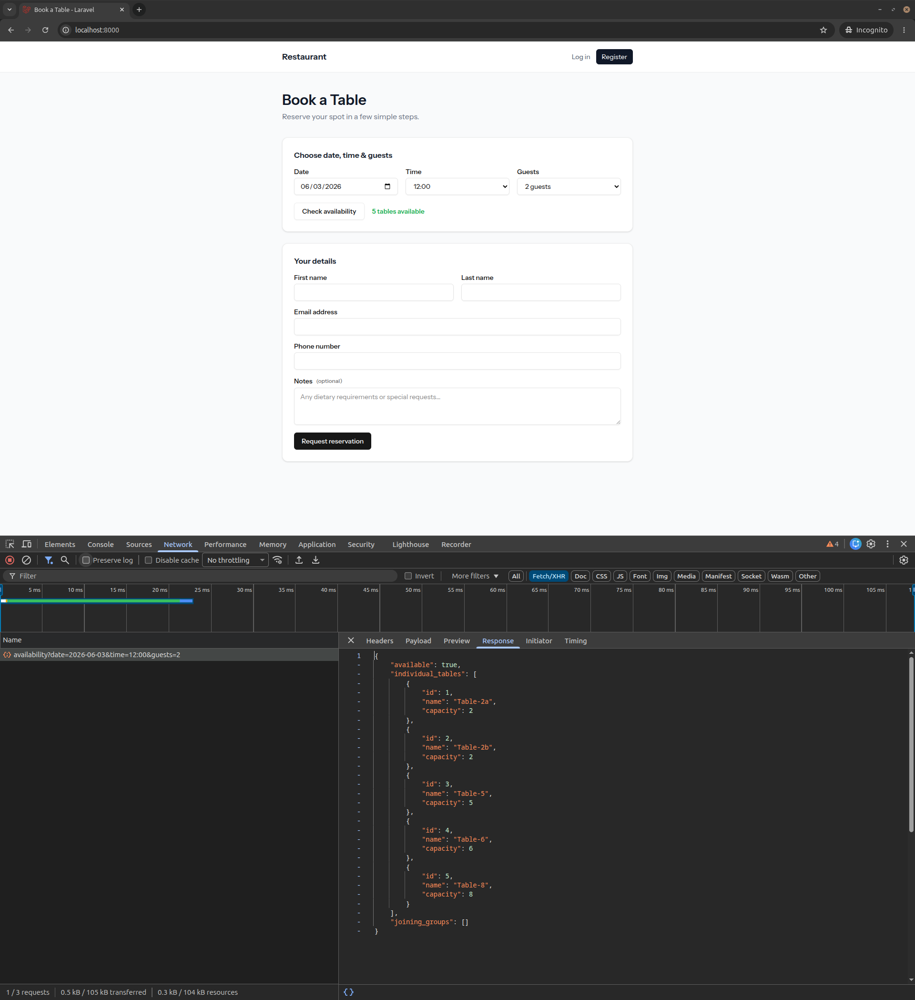
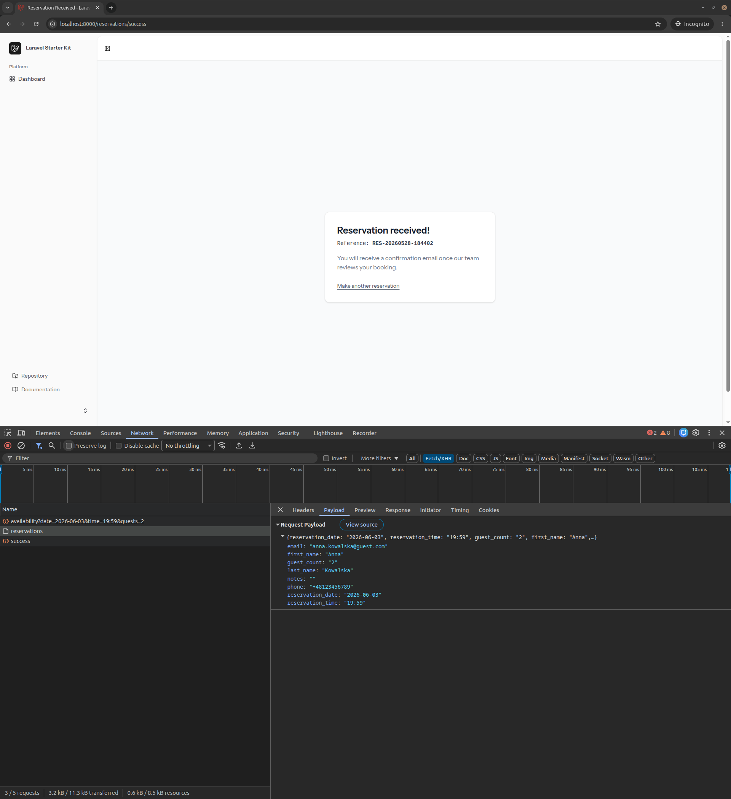

# Bug Reports

**ID:** BUG-001  
**Title:** Admin panel does not receive new reservations in real time; manual refresh required.  
**Severity:** Major.  
**Environment:** Chrome 148.0.7778.178, Docker.  
**Preconditions:** Fresh local test environment passing smoke tests ST-001, ST-002, ST-003.  
**Steps to reproduce:**

1. Open first instance of browser.
2. Go to `/login` and log in with Test Manager credentials.
3. Go to `/admin`.
4. Number of pending reservations show 0.
5. Open second instance of browser.
6. Go to `/` and check availability for B1 case ([test-data.md](../manual-tests/test-data.md)).
7. Fill the form **Your details** with credentials for G1 guest ([test-data.md](../manual-tests/test-data.md)).
8. Submit the form.
9. Go to first browser instance.

**Expected result:** Information about new reservation shows in toast in real time and pending reservations counter increases to 1.
**Actual result:** The number of pending reservations shows 0. No toast information. Pending reservation counter updates to 1 only after reloading admin panel.
**Suspected root cause:** Laravel Reverb client appears not to be initialized on `/admin`. DevTools Network → WS tab shows no WebSocket connection on the admin route, while the public `/` route does establish one (see ST-002).

**Evidence:**  


---

**ID:** BUG-002  
**Title:** The system allows the manager to confirm reservations even when the slot is fully booked.  
**Severity:** Major.  
**Environment:** Chrome 148.0.7778.178, Docker.  
**Preconditions:** Fresh local test environment passing all smoke tests.  
**Steps to reproduce:**

1. Open the browser.
2. Navigate to `/`.
3. Check availability for B2 case ([test-data.md](../manual-tests/test-data.md)).
4. Fill the form **Your details** with credentials for G1 guest ([test-data.md](../manual-tests/test-data.md)).
5. Submit the form.
6. Repeat steps 2.-5. two more times.
7. Go to Mailpit UI ( default:`http://localhost:8025`).
8. In UI search for three emails addressed to <manager@example.com> with subject starting with: **New reservation request**.
9. In each email click signed link **Confirm Reservation**.
10. Open second instance of browser.
11. Go to `/login` and log in with Test Manager credentials.
12. Go to `/admin/reservations`

**Expected result:** There is only one reservation with the status **Confirmed**. The system informs the manager that there are multiple pending reservations for the same slot (in the email, below the signed links, and also at `admin/reservations/pending`, where reservations for the same slot should be grouped). Confirming one of them should block the acceptance of other reservations for the same slot.  
**Actual result:** There are three reservations from guest G1 with the status **Confirmed**. The manager is able to accept multiple reservations for the same time slot, even though only one table is available at that time. The system does not display any warning or information about the reservation collision.

**Evidence:**



---

**ID:** BUG-003  
**Title:** Reservations panel does not show the assigned tables for reservations.  
**Severity:** Minor.  
**Environment:** Chrome 148.0.7778.178, Docker.  
**Preconditions:** Fresh local test environment passing all smoke tests.  
**Steps to reproduce:**

1. Open the browser and navigate to `/`.
2. Check availability for for B1 case ([test-data.md](../manual-tests/test-data.md)).
3. Fill the form **Your details** with credentials for G1 guest ([test-data.md](../manual-tests/test-data.md)).
4. Submit the form.
5. Go to Mailpit UI ( default:`http://localhost:8025`).
6. In UI search for email addressed to <manager@example.com> with subject starting with: **New reservation request**.
7. Make sure that reservation details are consistent with data provided earlier.
8. Click signed link **Confirm Reservation**.
9. Go to `/login` and log in with Test Manager credentials.
10. Go to `/admin/reservations`

**Expected result:** Reservations panel includes column named **Table** showing the name of assigned tables.  
**Actual result:** The assigned table information is missing from the reservation, despite the binding existing in the reservation_restaurant_table database table.  
**Suspected root cause:** The column displaying the assigned tables information is not implemented in [Index.vue](#) (lines 141-227).

**Evidences:**  
  


---

**ID:** BUG-004.1  
**Title:** At `/`, the guests selection field sub-values do not scale with the table guest sizes and tables joining group sizes.  
**Severity:** Major.  
**Environment:** Chrome 148.0.7778.178, Docker.  
**Preconditions:** Fresh local test environment passing all smoke tests.  
**Steps to reproduce:**

**Case A**

1. Open the browser and navigate to `/login`.
2. Log in with Test Manager credentials.
3. Navigate to `/admin/tables`.
4. Click **Add Table** button.
5. Fill up form with:  
   **Capacity** = 24  
   **Name** = Test-24  
   **Active** = true
6. Click **Add Table** button.
7. Make sure, that table **Test-24** is listed and is active.
8. Navigate to `/`.

**Case B**

1. Navigate to `/login`.
2. Log in with Test Manager credentials.
3. Navigate to `/admin/tables/groups`.
4. Click **Add Group** button.
5. Fill up form with:  
   **Name** = 10 guests,
   **Min Guests to Trigger Joining** = 10
   **Tables** - Table-2a, Table-8.
6. Click **Add Group** button.
7. Make sure, that group **10 guests** is on the list.
8. Navigate to `/`.

**Expected result:** Under **Guests** selection field are sub-values in range 1 to 24 (Case A) or 1 to 10 (Case B).  
**Actual result:** Under **Guests** selection field are sub-values in range 1 to 8.  
**Suspected root cause:** Sub-values in guests selection field are hardcoded. File [Welcome.vue](#) (line 252).

**Evidences:**  

  


---

**ID:** BUG-005  
**Title:** Checking available tables returns a detailed list of tables instead of the total count.  
**Severity:** Minor.  
**Environment:** Chrome 148.0.7778.178, Docker.  
**Preconditions:** Fresh local test environment passing all smoke tests.  
**Steps to reproduce:**

1. Navigate to `/`.
2. Open DevTools -> Network, select **Fetch/XHR** tab.
3. Check availability for for B1 case ([test-data.md](../manual-tests/test-data.md)).
4. Check Inertia response in DevTools.

**Expected result:** Response returns only total number of free tables.  
**Actual result:** Response returns detailed list containing table names and capacity.  
**Evidence:**


---

**ID:** BUG-006  
**Title:** Backend does not validate Booking Time selection field sub-values.  
**Severity:** Minor.  
**Environment:** Chrome 148.0.7778.178, Docker.  
**Preconditions:** Fresh local test environment passing all smoke tests.  
**Steps to reproduce:**

1. Navigate to `/`.
2. In Date field in **Choose date, time & guests** form check next Wednesday.
3. Open the Browser's Inspector.
4. Inside the `<select>` tag:

   ```html
   <select
     id="time"
     class="border-input focus-visible:ring-ring/50 h-9 w-full rounded-md border bg-transparent px-3 py-1 text-sm shadow-xs outline-none transition-[color,box-shadow] focus-visible:ring-[3px] disabled:cursor-not-allowed disabled:opacity-50 dark:bg-input/30"
   ></select>
   ```

   Add the following option:

   ```html
   <option value="19:59">19:59</option>
   ```

5. Fill up the **Choose date, time & guests** form with:
   - **Time**: 19:59
   - **Guests**: 2 guests
6. Click the **Check availability** button.
7. Fill the form **Your details** with credentials for G1 guest ([test-data.md](../manual-tests/test-data.md)).
8. Click **Request reservation**.

**Expected result:** System does not create pending reservation. The booking time is outside the scope of the selected sub-values. The guest gets information that time is too close to closing time.  
**Actual result:** Reservation is created and got status **Pending**.  
**Evidence:**  


---
